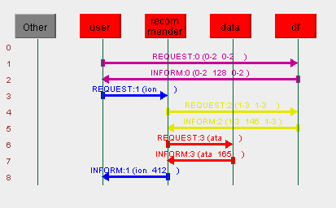

# Sistema multiagente de ayuda en la planificación del estudio

## 1. Descripción del sistema
Este proyecto implementa un sistema multiagente desarrollado con JADE cuyo objetivo es recomendar un plan de estudio personalizado a partir de la situación indicada por el usuario. Para ello, el sistema recoge datos como los días restantes hasta el examen, las horas disponibles de estudio al día, el nivel actual de conocimiento, la dificultad percibida de la asignatura y el porcentaje de temario ya preparado.

A partir de esta información, el sistema genera una recomendación entre distintos tipos de planes de estudio: intensivo, de refuerzo, equilibrado o de mantenimiento. Además, se muestra una distribución orientativa del estudio asociada al plan recomendado.

El sistema aplica una técnica de clasificación supervisada mediante Weka. En concreto, el agente recomendador utiliza un clasificador J48 entrenado con un conjunto de datos externo en formato ARFF, que contiene ejemplos de situaciones de estudio y el tipo de plan asociado.

## 2. Arquitectura del sistema multiagente
El sistema está compuesto por tres agentes principales:

### 2.1 UserAgent
El `UserAgent` representa al usuario dentro del sistema. Es el encargado de crear y gestionar la interfaz gráfica, recoger los datos introducidos por el usuario y enviar una solicitud de recomendación al agente recomendador.

La interfaz permite introducir los valores necesarios para generar la recomendación y muestra tanto el estado del proceso como el resultado obtenido.

### 2.2 DataAgent
El `DataAgent` actúa como agente de adquisición de información. Su función consiste en proporcionar al sistema los datos externos necesarios para realizar la recomendación.

Este agente lee el fichero `data/reglas_de_estudio.txt`, que contiene las distribuciones sugeridas para cada tipo de plan, y proporciona también la ruta del conjunto de datos `data/study_plans.arff`, utilizado por el agente recomendador para entrenar el clasificador.

### 2.3 RecommenderAgent
El `RecommenderAgent` es el agente encargado del procesamiento inteligente. Recibe la información del usuario, solicita al `DataAgent` los datos necesarios y aplica un clasificador J48 de Weka para determinar el tipo de plan de estudio recomendado.

Una vez obtenido el plan, el agente recupera la distribución asociada a dicho plan y devuelve la respuesta al `UserAgent`.

## 3. Técnica de inteligencia aplicada
La técnica principal aplicada en el sistema es la clasificación supervisada. Para ello se utiliza Weka, concretamente el algoritmo J48, que genera un árbol de decisión a partir de ejemplos previamente etiquetados.

El conjunto de datos utilizado se encuentra en el fichero `data/study_plans.arff`. Cada instancia representa una situación de estudio concreta y contiene los siguientes atributos:

- `dias`: número de días restantes hasta el examen.
- `horas`: número de horas disponibles de estudio al día.
- `nivel`: nivel actual del usuario (`bajo`, `medio` o `alto`).
- `dificultad`: dificultad percibida de la asignatura (`baja`, `media` o `alta`).
- `temario`: porcentaje de temario preparado.
- `plan`: tipo de plan recomendado.

El atributo `plan` actúa como clase a predecir. Cuando el usuario introduce sus datos, el sistema crea una nueva instancia sin clase asignada y el clasificador predice el plan de estudio más adecuado.

## 4. Flujo de comunicación entre agentes
El flujo principal de comunicación es el siguiente:

1. El usuario introduce sus datos en la interfaz gráfica.
2. El `UserAgent` busca en el Directory Facilitator un agente que ofrezca el servicio de recomendación.
3. El `UserAgent` envía un mensaje ACL de tipo `REQUEST` al `RecommenderAgent`.
4. El `RecommenderAgent` busca en el Directory Facilitator un agente que ofrezca el servicio de datos.
5. El `RecommenderAgent` envía un mensaje ACL de tipo `REQUEST` al `DataAgent`.
6. El `DataAgent` devuelve mediante un mensaje `INFORM` la ruta del dataset y las reglas de distribución.
7. El `RecommenderAgent` carga el dataset, entrena el clasificador J48 y clasifica la instancia introducida por el usuario.
8. El `RecommenderAgent` devuelve al `UserAgent` un mensaje `INFORM` con el plan recomendado.
9. El `UserAgent` muestra la recomendación en la interfaz gráfica.



Los agentes utilizan el Directory Facilitator de JADE para registrar y localizar servicios. Además, se emplean plantillas `MessageTemplate` para filtrar los mensajes recibidos y llamadas bloqueantes con `blockingReceive` para esperar respuestas concretas.

## 5. Estructura del proyecto
La estructura principal del proyecto es la siguiente:

```
study-planner/
├── data/
│   ├── reglas_de_estudio.txt
│   └── study_plans.arff
├── lib/
│   ├── jade.jar
│   ├── commons-codec-1.3.jar
│   └── weka.jar
├── src/
│   ├── agents/
│   │   ├── DataAgent.java
│   │   ├── RecommenderAgent.java
│   │   ├── UserAgent.java
│   │   └── UserAgentInterfaz.java
│   └── utils/
│       └── DFUtils.java
└── README.md
````

- `src/agents/`: contiene los agentes JADE y la interfaz gráfica del sistema
- `src/utils/`: contiene utilidades comunes para registrar y buscar servicios en el Directory Facilitator
- `data/`: contiene los ficheros externos utilizados por el sistema.
- `lib/`: contiene las bibliotecas externas necesarias para ejecutar el proyecto.

## 6. Requisitos e instalación
Para ejecutar el proyecto es necesario disponer de:

- Java JDK.
- JADE 4.6.0.
- Weka.
- commons-codec.

Las bibliotecas necesarias deben incluirse en la carpeta `lib/` del proyecto:

```
lib/
├── jade.jar
├── commons-codec-1.3.jar
└── weka.jar
```

En caso de utilizar Visual Studio Code, puede añadirse la siguiente configuración en `.vscode/settings.json` para que el entorno reconozca las librerías externas:
```
{
  "java.project.referencedLibraries": [
    "lib/**/*.jar"
  ]
}
```

## 7. Compilación y ejecución
Los siguientes comandos deben ejecutarse desde la carpeta raíz del proyecto, es decir, desde `study-planner`.

En primer lugar, se recomienda eliminar la carpeta `bin/` si ya existía una compilación previa:

```
rm -rf bin
```

Después, se compila el proyecto con el siguiente comando:

```
javac -cp "lib/*" -d bin src/agents/*.java src/utils/*.java
```

Para ejecutar la plataforma JADE con los tres agentes principales, se utiliza:

```
java -cp "bin:lib/*" jade.Boot -gui "data:agents.DataAgent;recommender:agents.RecommenderAgent;user:agents.UserAgent"
```

En caso de utilizar Java 17 y obtener un aviso relacionado con permisos de acceso de Weka, se puede ejecutar el proyecto con la siguiente variante:

```
java --add-opens java.base/java.lang=ALL-UNNAMED -cp "bin:lib/*" jade.Boot -gui "data:agents.DataAgent;recommender:agents.RecommenderAgent;user:agents.UserAgent"
```

Al ejecutar el sistema se abre la interfaz gráfica del `UserAgent`, desde la que el usuario puede introducir los datos de estudio y solicitar la recomendación del plan.

## 8. Datos externos utilizados

El sistema utiliza dos ficheros externos ubicados en la carpeta `data/`.

### 8.1 `study_plans.arff`

Este fichero contiene el conjunto de datos utilizado por Weka para entrenar el clasificador J48. Cada instancia representa una situación de estudio y el tipo de plan asociado.

Los atributos del dataset son:

- `dias`: número de días restantes hasta el examen.
- `horas`: número de horas disponibles de estudio al día.
- `nivel`: nivel actual del usuario (`bajo`, `medio` o `alto`).
- `dificultad`: dificultad percibida de la asignatura (`baja`, `media` o `alta`).
- `temario`: porcentaje de temario preparado.
- `plan`: tipo de plan recomendado. Es el atributo de clase que el clasificador debe predecir.

### 8.2 `reglas_de_estudio.txt`

Este fichero contiene la distribución sugerida para cada tipo de plan de estudio. Por ejemplo:

```
intensivo=50% ejercicios, 30% teoría, 20% simulacros
refuerzo=40% teoría, 40% ejercicios guiados, 20% repaso
equilibrado=35% teoría, 45% práctica, 20% simulacros
mantenimiento=30% repaso, 50% simulacros, 20% puntos débiles
```

El `DataAgent` lee este fichero y envía su contenido al `RecommenderAgent`, que lo utiliza para completar la respuesta generada tras la clasificación.

## 9. Casos de prueba

Los siguientes casos permiten comprobar el funcionamiento del sistema. En todos ellos, los datos se introducen desde la interfaz gráfica del `UserAgent`.

### Caso 1: plan de mantenimiento

**Entrada**:

```
Días hasta el examen: 20
Horas diarias de estudio: 2
Nivel actual: alto
Dificultad de la asignatura: baja
Porcentaje de temario preparado: 85
```

**Respuesta esperada**:

```
Plan recomendado: mantenimiento
Técnica aplicada: clasificación supervisada con Weka (J48)
Distribución sugerida: 30% repaso, 50% simulacros, 20% puntos débiles
```

### Caso 2: plan intensivo

**Entrada**:

```
Días hasta el examen: 5
Horas diarias de estudio: 2
Nivel actual: medio
Dificultad de la asignatura: media
Porcentaje de temario preparado: 50
```

**Respuesta esperada**:

```
Plan recomendado: intensivo
Técnica aplicada: clasificación supervisada con Weka (J48)
Distribución sugerida: 50% ejercicios, 30% teoría, 20% simulacros
```

### Caso 3: plan de refuerzo por nivel bajo

**Entrada**:

```
Días hasta el examen: 15
Horas diarias de estudio: 2
Nivel actual: bajo
Dificultad de la asignatura: media
Porcentaje de temario preparado: 60
```

**Respuesta esperada**:

```
Plan recomendado: refuerzo
Técnica aplicada: clasificación supervisada con Weka (J48)
Distribución sugerida: 40% teoría, 40% ejercicios guiados, 20% repaso
```

### Caso 4: plan de refuerzo por dificultad alta

**Entrada**:

```
Días hasta el examen: 15
Horas diarias de estudio: 2
Nivel actual: medio
Dificultad de la asignatura: alta
Porcentaje de temario preparado: 60
```

**Respuesta esperada**:

```
Plan recomendado: refuerzo
Técnica aplicada: clasificación supervisada con Weka (J48)
Distribución sugerida: 40% teoría, 40% ejercicios guiados, 20% repaso
```

### Caso 5: plan equilibrado

**Entrada**:

```
Días hasta el examen: 15
Horas diarias de estudio: 3
Nivel actual: medio
Dificultad de la asignatura: media
Porcentaje de temario preparado: 60
```

**Respuesta esperada**:

```
Plan recomendado: equilibrado
Técnica aplicada: clasificación supervisada con Weka (J48)
Distribución sugerida: 35% teoría, 45% práctica, 20% simulacros
```

## 10. Cierre del sistema

Al cerrar la ventana principal de la interfaz gráfica, se finaliza el agente de usuario (`UserAgent`). El resto de agentes pueden cerrarse desde la interfaz de administración de JADE o finalizando la ejecución del programa.

## 11. Declaración de uso de IA
Durante el desarrollo de la práctica se ha utilizado inteligencia artificial como apoyo para la planificación del sistema, la revisión de la arquitectura multiagente, la depuración de errores y la mejora de comentarios.

El código final ha sido revisado, adaptado y probado por los miembros del grupo. Las decisiones de diseño, la integración de JADE, la comunicación entre agentes, el uso de Weka y la validación del funcionamiento del sistema han sido realizadas por el grupo.